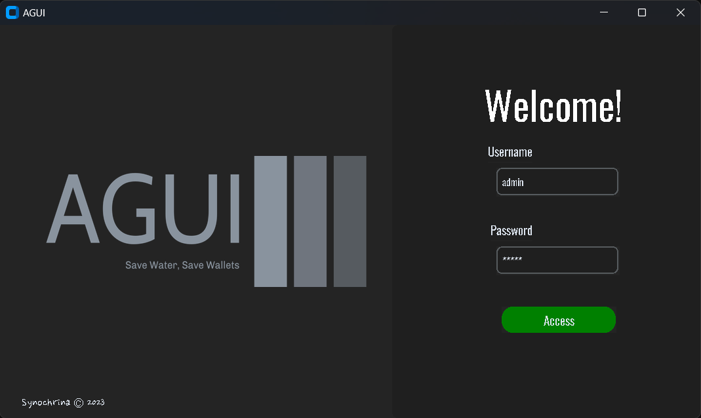
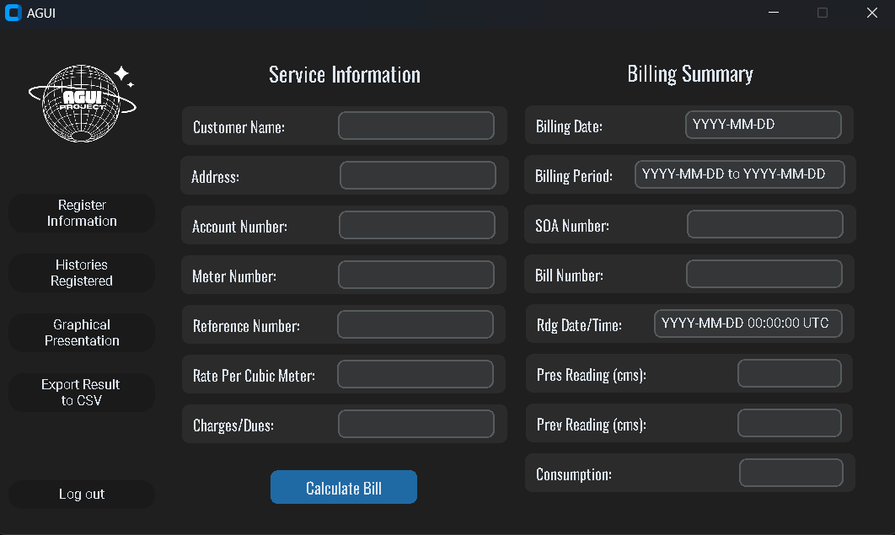
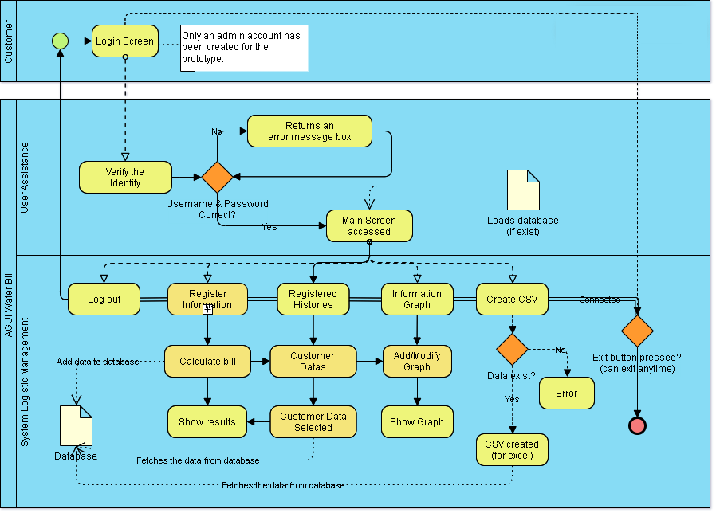
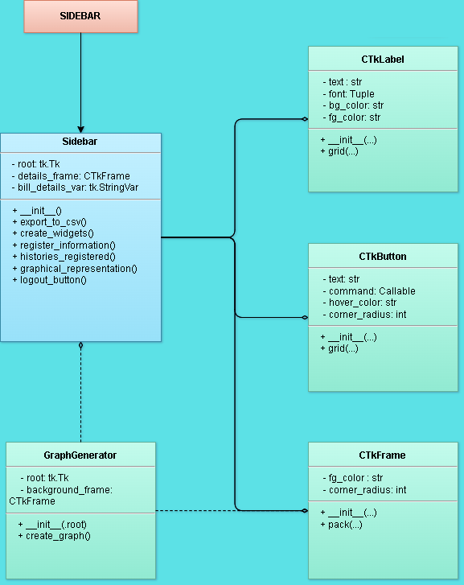
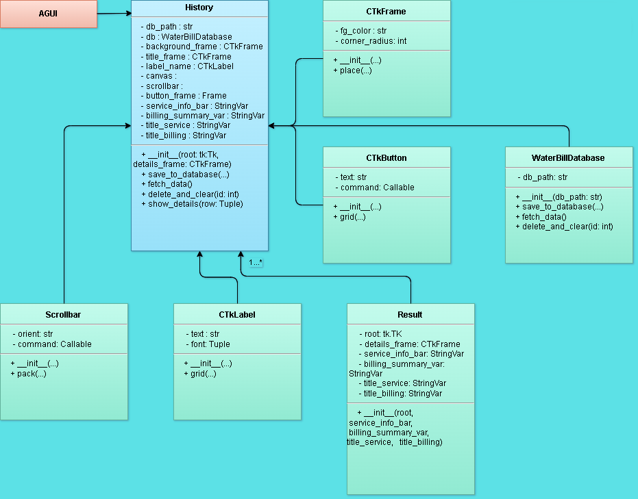

# Water Bill Calculator

This application is a comprehensive water bill management system, designed to calculate and track water consumption for multiple customers. It features a user-friendly GUI built with Tkinter, allowing for easy input and management of customer data. The application integrates with an SQLite database, providing robust data persistence and retrieval capabilities. Key features include the ability to calculate individual customer water bills based on consumption data, display billing history, and generate visualizations for consumption trends. This makes it an ideal tool for small to medium-sized water utilities or property management entities looking for a simple, yet effective, water bill tracking solution.

# Visual Information

## Flowchart

## UML Diagram

### Login

### Sidebar

### Register

### Database

### History

### Graph

### Result

## How to Use

1. pip install -r requirements.txt.
2. python main.py / output/AGUI/AGUI ALPHA.exe.
3. Input details that exist in your receipt.
4. Click "Calculate Bill" to see the results.
5. Click "Histories Registered" to view saved water bill data.
6. Click "Graphical Representation" to view the spendings of all customers.

# License

This work is licensed under a Creative Commons Attribution-NonCommercial-NoDerivs 4.0 International License.

## You are free to:

- Share — copy and redistribute the material in any medium or format
The licensor cannot revoke these freedoms as long as you follow the license terms.

## Under the following terms:

- Attribution — You must give appropriate credit, provide a link to the license, and indicate if changes were made. You may do so in any reasonable manner, but not in any way that suggests the licensor endorses you or your use.

- NonCommercial — You may not use the material for commercial purposes.

- NoDerivatives — If you remix, transform, or build upon the material, you may not distribute the modified material.

- No additional restrictions — You may not apply legal terms or technological measures that legally restrict others from doing anything the license permits.

## Notices:

- You do not have to comply with the license for elements of the material in the public domain or where your use is permitted by an applicable exception or limitation.

- No warranties are given. The license may not give you all of the permissions necessary for your intended use. For example, other rights such as publicity, privacy, or moral rights may limit how you use the material.

